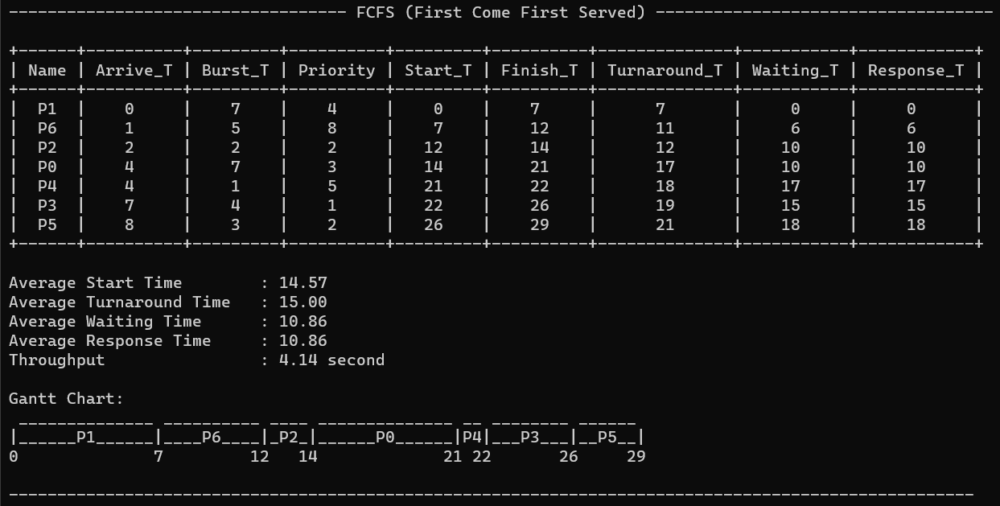
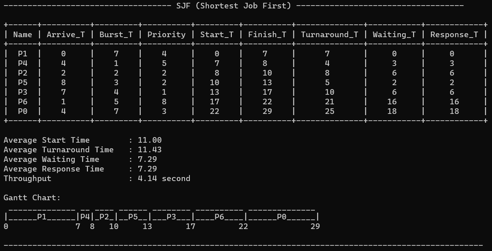
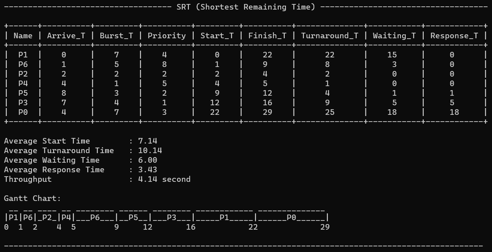
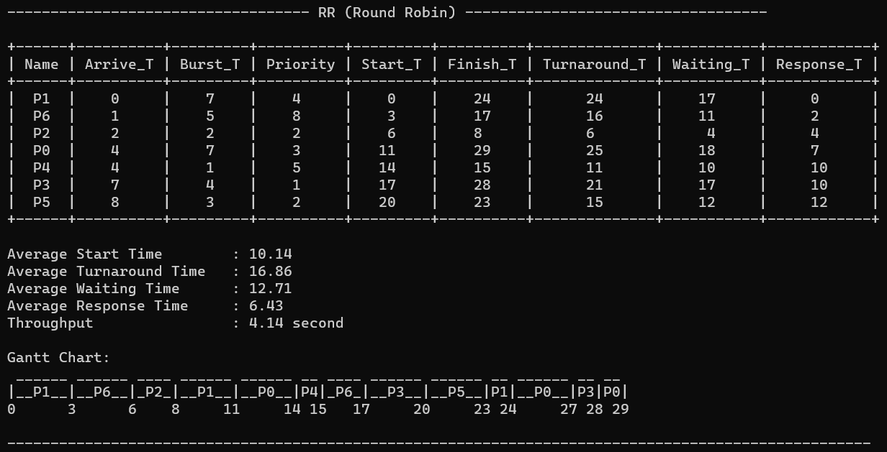

# **Simulasi Algoritma Penjadwalan**

## **Konsep**
Berikut merupakan konsep dasar membuat simulasi algoritma penjadwalan

### **Scheduling Algorithm:**
1. **FCFS** (First Come First Served) => diproses berdasarkan waktu kedatangan / arrive time
2. **SJF** (Shortest Job First) => diproses berdasarkan waktu pemrosesan / burst time
3. **SRT** (Shortest Remaining Time) => diproses berdasarkan sisa waktu pemrosesan / burst time remaining
4. **Priority Non-Preemptive** => diproses berdasarkan priority
5. **Priority Preemptive** => diproses berdasarkan priority
6. **RR** (Round Robin) => waktu pemrosesan berdasarkan quantum

### **Input:**
- **Process name**: `string`
- **arrive time**: `int`
- **Burst time**: `int`
- **priority**: `int` (Priority Scheduling)
- **quantum**: `int` (RR)

### **Test Case:**
input test case dengan data file `.txt`, contoh format data:
```YAML
#Name #ArriveT #BurstT #Priority
P0 0 12 3
P1 19 6 4
P2 13 9 4
P3 4 1 5
P4 8 6 2
P5 8 2 6
P6 10 10 1
2 #quantum
```

#### **Fitur:**  
in the table:
- **start time** => waktu mulai ketika dieksekusi oleh CPU
- **finish time** => waktu selesai dieksekusi
- **turnaround time** => waktu dari datang sampai selesai dieksekusi  
*`turnaround time = finish time - arrive time`*
- **waiting time** => waktu tunggu saat sedang tidak dieksekusi  
*`waiting time = turnaround time - burst time`*
- **response time** => waktu dari datang sampai dieksekusi  
*`response time = start time - Arrival time`*

off table:
- **throughput** =>  
*`throughput = total time / n process`*
- **average start time** =>  
*`average start time = sum start time / n process`*
- **average turnaround time** =>  
*`average turnaround time = sum turnaround time / n process`*
- **average waiting time** =>  
*`average waiting time = sum waiting time / n process`*
- **average response time** =>  
*`average response time = sum response time / n process`*

***note:** `total time` => total waktu eksekusi semua proses, `n proses` => jumlah proses yang dieksekusi*

- **gantt chart**,
ex:
```YAML
 ________ __ __________ ______________ ______ ____
|___P1___|P2|____P0____|______P4______|__P3__|_P5_|
0        4  5         10             17     20   22
```

### **Simulation:**
1. input data
2. process algorithm, choice (5 scheduling algorithm)
3. output fitur, tiap algoritma menampilkan informasi output berupa fitur in table, fitur off table, dan gantt chart
note: bahasa python 


## **Design Program**
Desain program dibuat dalam bentuk `OOP` (Object Oriented Programing) menggunakan bahasa `python`. Model ini terdiri dari beberapa kelas:
1. **Process** => Kelas ini digunakan untuk menampung atibut input proses dan fitur-fitur yang sudah dihitung
2. **ProcessState** => 
3. **SchedulingAlgorithms** => kelas ini digunakan untuk menampung proses dengan perhitungannya yang dibuat dalam method
4. **FCFS** => 
5. **SJF** =>
6. **SRT** =>
7. **Priority** =>
8. **PriorityPreemptive** =>
9. **RR** =>
10. **Table** => 

selain itu juga dibuat fungsi untuk print fitur in table dan off table juga gantt chartnya disimpan dalam file [`fitur.py`](fitur.py)

**Class Diagram**


### **Penjelasan Inheritance dan Composite**

**Inheritance**  
- FCFS `is a` SchedulingAlgorithms  
- SJF `is a` SchedulingAlgorithms  
- SRT `is a` SchedulingAlgorithms  
- Priority `is a` SchedulingAlgorithms  
- PriorityPreemptive `is a` SchedulingAlgorithms
- RR `is a` SchedulingAlgorithms

**Composite**  
- SchedulingAlgorithms `has a` Process

## **Alur Program / Simulasi**

program di running dalam command promt atau powershell dengan meng-execute [`main.py`](main.py)
```YAML
py main.py
```

```YAML
----------------------------------- Simulation Scheduling Algorithm -----------------------------------

Select input proses:
1. Manual
2. Import test case
0. Exit
==============================
Enter number:
-> 
----------
```
jika memilih `1`
```YAML
Enter how many process: 1
Enter Arrive Time: 0
Enter Burst Time : 1
```

jika memilih `2`
```YAML
Select file .txt:
1. test-case\data.txt
2. test-case\data2.txt
3. test-case\data3.txt
4. test-case\data4.txt
5. test-case\dontUse.txt
==============================
Warning! Pastikan data sesuai dengan format
Enter number:
-> 
----------
```

```YAML
Input Process:

+------+----------+---------+----------+
| Name | Arrive_T | Burst_T | Priority |
+------+----------+---------+----------+
|  P0  |    4     |    7    |    3     |
|  P1  |    0     |    7    |    4     |
|  P2  |    2     |    2    |    2     |
|  P3  |    7     |    4    |    1     |
|  P4  |    4     |    1    |    5     |
|  P5  |    8     |    3    |    2     |
|  P6  |    1     |    5    |    8     |
+------+----------+---------+----------+
```

```YAML
Scheduling Algorithms:
1. FCFS (First Come First Served)
2. SJF (Shortest Job First)
3. SRT (Shortest Remaining Time)
4. Priority Scheduling (Non-Preemptive)
5. Priority Scheduling (Preemptive)
6. RR (Round Robin)
0. Exit
==============================
Enter number:
-> 
----------
```

```YAML
----------------------------------- FCFS (First Come First Served) -----------------------------------

+------+----------+---------+----------+---------+----------+--------------+-----------+------------+
| Name | Arrive_T | Burst_T | Priority | Start_T | Finish_T | Turnaround_T | Waiting_T | Response_T |
+------+----------+---------+----------+---------+----------+--------------+-----------+------------+
|  P1  |    0     |    7    |    4     |    0    |    7     |      7       |     0     |     0      |
|  P6  |    1     |    5    |    8     |    7    |    12    |      11      |     6     |     6      |
|  P2  |    2     |    2    |    2     |   12    |    14    |      12      |    10     |     10     |
|  P0  |    4     |    7    |    3     |   14    |    21    |      17      |    10     |     10     |
|  P4  |    4     |    1    |    5     |   21    |    22    |      18      |    17     |     17     |
|  P3  |    7     |    4    |    1     |   22    |    26    |      19      |    15     |     15     |
|  P5  |    8     |    3    |    2     |   26    |    29    |      21      |    18     |     18     |
+------+----------+---------+----------+---------+----------+--------------+-----------+------------+

Average Start Time        : 14.57
Average Turnaround Time   : 15.00
Average Waiting Time      : 10.86
Average Response Time     : 10.86
Throughput                : 4.14 second

Gantt Chart:
 ______________ __________ ____ ______________ __ ________ ______
|______P1______|____P6____|_P2_|______P0______|P4|___P3___|__P5__|
0              7         12   14             21 22       26     29

----------------------------------------------------------------------------------------------------
```

## **Result**
**FCFS**

**SJF**

**SRT**

**Priority Non-Preemptive**

**Priority Preemptive**

**RR**
